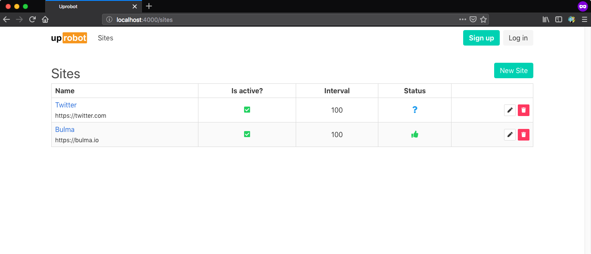
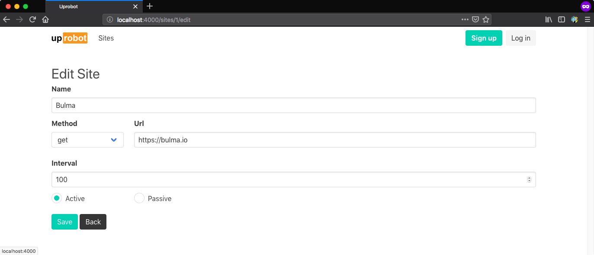
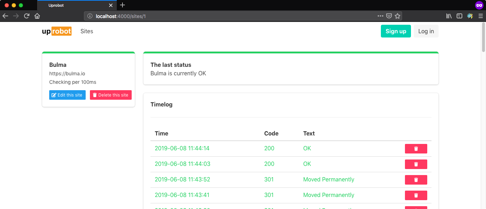

# Uprobot

Uprobot is a ping bot for given URLs. I guess you may want to use a health check service like this for your deployments.

## Thanks

- I used [bulma](https://bulma.io/) as CSS framework, so thanks a lot all Bulma contributors.
- I used [logoly.pro](https://logoly.pro/#/) for create Uprobot's logo, so thanks a lot [HuanCheng Bai](https://github.com/bestony)

## Screenshots

## Installation

To start your Phoenix server:

  * Install dependencies with `mix deps.get`
  * Create and migrate your database with `mix ecto.setup`
  * Install Node.js dependencies with `cd assets && npm install`
  * Start Phoenix endpoint with `mix phx.server`

Now you can visit [`localhost:4000`](http://localhost:4000) from your browser.

Ready to run in production? Please [check our deployment guides](https://hexdocs.pm/phoenix/deployment.html).

## TODO

- [ ] Use different intervals in GenServer for each site,
- [ ] Visualize downtimes with reasons and response times,
- [ ] Dockerize and deploy
- [ ] Think about good features
